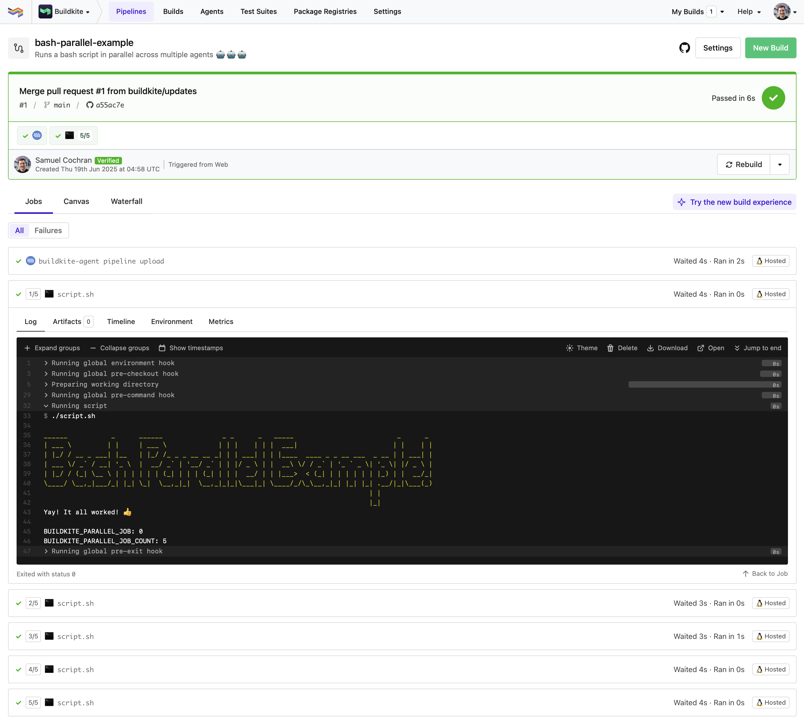

# Buildkite Parallel Bash Pipeline Example

This repository is an example [Buildkite](https://buildkite.com/) pipeline for running a simple bash script in parallel across multiple agents, [script.sh](script.sh).

The script simply prints some debug output and exits with a success code (0).

## License

See [Licence.md](Licence.md) (MIT)
